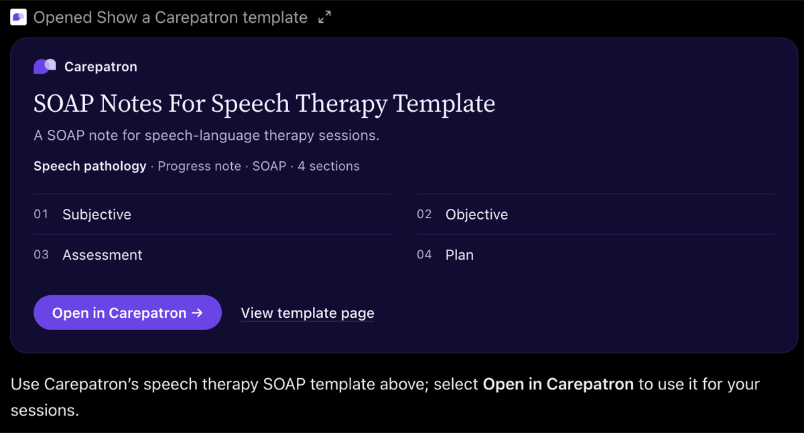

# Carepatron for ChatGPT

Clinicians already ask ChatGPT for SOAP notes, intake forms and treatment plans. This plugin answers with Carepatron's own template and a button that opens it in their Carepatron workspace.



## Why

ChatGPT reaches 1.2 billion people a week ([Sam Altman at DevDay, 29 Sept 2026](https://the-decoder.com/chatgpt-now-reaches-1-2-billion-people-every-week-openai-says/)). Some of them are therapists, physios and dietitians looking for exactly the documents Carepatron already publishes free. Today they get a generic answer. With this plugin they get Carepatron's template, one click from a draft note in Carepatron. That's a new acquisition channel that costs nothing per click.

I couldn't find any practice-management or EHR product with a ChatGPT plugin yet ([research notes](docs/RESEARCH.md#7-landscape)).

## What happens

1. A clinician asks ChatGPT something like *"I'm a speech therapist and need a SOAP note format."* They don't need to mention Carepatron.
2. ChatGPT calls `templates.search` with a profession and a note type, then `templates.get`.
3. A Carepatron card shows the template's sections, with **Open in Carepatron** and **View template page**.
4. **Open in Carepatron** goes to `app.carepatron.com/Templates?previewTemplateId=…`. After login, the template opens as a draft note, which is the "first note" moment for a new practitioner.

## Privacy by design

The tools can't receive patient information, because there is no field to put it in.

- **Inputs are fixed choices.** `profession`, `document_type`, `note_format` or a `template_id`. The schemas reject any other field, and a test sends `client_name: "Maria Lopez"` to prove it.
- **Nothing is stored.** The server holds no database and no state between requests. Logs record only the tool name and the choices picked.
- **Verified in practice, not just in theory.** I ran prompts containing client names, ages and PHQ-9 scores in ChatGPT and read the server's request log. No client detail ever reached the server.

## What I verified

| Check | Result |
|---|---|
| 15 test prompts in ChatGPT (5 that name Carepatron, 5 that don't, 5 that must not trigger), tool calls checked in the request log | 15/15 |
| Automated tests (tools, catalog, HTTP transport, restart, malformed requests) | 37 passing |
| Pre-demo link check (10 template pages, 10 PDFs) | 20/20 live |
| Hosted on Cloudflare Workers: both tools, the card, rejecting client details, the UTM tags | All passing |
| Security review | One real issue found and fixed: a malformed path could crash the server. Also: loopback-only binding, a host allowlist, and card links limited to Carepatron domains |

## Decisions and trade-offs

- **10 hand-checked templates instead of scraping 4,600.** A demo has to work every time, and scraping the site of the company you're pitching looks bad. Scaling up is a data task, not a redesign ([HANDOFF.md](docs/HANDOFF.md#scale-it)).
- **No free-text inputs.** A keyword box would match odd requests slightly better, but "can't receive patient data" is a stronger guarantee than "filters patient data".
- **Stateless server.** Each request gets a fresh server, so a restart never breaks a chat.
- **Brand-native card.** Built from measurements of carepatron.com: their purple, cream and ink, with free stand-ins for Copernicus and Helvetica Now. See [DESIGN.md](DESIGN.md).
- **Every link is tagged.** The template page, the PDF and the Open in Carepatron button all carry `utm_source=chatgpt`. The app keeps the tags in place when it opens the template.
- **Tried and reverted.** I briefly showed the card on every search, plus a closing link under ChatGPT's answer, to push more clicks. Two calls to action in one reply felt pushy, so the card stays a single, clear offer.
- **Found along the way.** The BIRP template page's Download button links to `birp-notes-template.pdff`, which returns a 404. The file itself lives at `.pdf`.

## Try it

**Hosted (no setup):** in ChatGPT, turn on developer mode (Settings → Security and login, or Settings → Plugins), then at chatgpt.com/plugins choose **Add → Create MCP App**. Enter:

```
https://carepatron-chatgpt-plugin.carepatron-chatgpt-plugin.workers.dev/mcp
```

with **No authentication**. Type `@Carepatron` in a new chat.

**Locally:**

```bash
npm install
npm test
npm run check-links                       # every template page and PDF still loads
PUBLIC_HOST=<ngrok-domain> npm start      # http://localhost:8787/mcp
PUBLIC_HOST=<ngrok-domain> npm run tunnel # second terminal
npm run deploy                            # publish to Cloudflare Workers
```

## What I'd do next

- **Measure it.** Outbound links already carry `utm_source=chatgpt`. Next, tag ChatGPT-sourced signups in product analytics.
- **Follow through in lifecycle.** A clinician who arrives from a ChatGPT SOAP template should get onboarding that starts from that note, not the generic welcome series.
- **Test the card.** Compare button copy and the section preview against click-through to the app.
- **Grow the catalog.** Template pages already carry structured data, so the full library is reachable.
- **Other assistants.** This is a standard MCP server, so the same code should work in Claude. That's untested so far.

## Layout

```
src/catalog.ts   the 10 templates (metadata, section headings and links only)
src/tools.ts     templates.search and templates.get
src/mcp.ts       MCP server and card resource, shared by both runtimes
src/server.ts    Node entry (local + ngrok)
src/worker.ts    Cloudflare Workers entry (hosted)
web/card.html    the card (no framework, no build step)
docs/            handoff guide and research notes
```

## License and trademarks

The code is MIT licensed, so you're free to use, change and ship it. The Carepatron name, logo and templates belong to Carepatron. This is an independent prototype, built for Carepatron to take over, and isn't affiliated with or endorsed by Carepatron or OpenAI.
